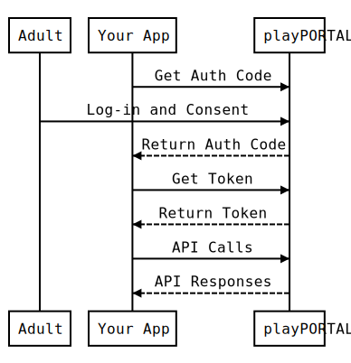

# iOKids Social Sign-On API

## Overview
iOKids Social Sign-On API implements an [OAuth 2.0 protocol](https://tools.ietf.org/html/rfc6749.html) and uses [JSON Web 
Tokens](https://tools.ietf.org/html/rfc7519) (JWT) as a [bearer token](https://tools.ietf.org/html/rfc6750) format. 
iOKids supports scenarios for
* web server applications, 
* client-side (JavaScript) applications, and 
* iOS and Android mobile applications (via call-out to mobile web browser). 

iOKids will support single sign-on through the iOKids native mobile apps in an upcoming release. 

**Who who should read this guide?**

This guide is for developers who want to integrate the iOKids Social Sign-On into their application. It covers the [OAuth2 
flows](#oauth2-flows) for three application types (listed above) and walks through a sample implementations for each. 

As a developer, you should have a passing familiarity with OAuth and have identified an [OAuth library](#oauth2-libraries) 
to assist you. With that background, your job will be mainly configuration and testing.


## Getting Started
1. Start with Sandbox Testing. Either [sign-up for an iOKids Developer Account](https://sandbox.iokids.net/developer) and 
use our public sandbox or run a [mock iOKids server](MockServer.md) via [Docker](https://hub.docker.com/r/dynepic/iokids-sso-mock-server/) to simulate iOKids SSO on your development machine. 
If you run a sandbox locally, follow the documentation below but use the client and [user data](MockServer.md#user-data) provided with the mock server.

2. Place the iOKids Social Sign-On button in your app:<br/>
    
    See our [brand guidelines](BrandGuidelines.md) For help placing the button. 

3. Configure the OAuth flow best suited for your application. Test it in our sandbox environment.

4. Upgrade your iOKids Developer Account to an iOKids Partner Account by selecting one of the [partner on-boarding options](https://iokids.net/partners).

5. Go live! When you are ready, send [support@dynepic.com](mailto:support@dynepic.com) and email and we will enable your
account for production use.

## Your Duties as an iOKids Partner
Our goal is to provide a kid-safe, parent-controlled social network. When you integrate with iOKids, you are committing 
to these guidelines:

* Establish a privacy policy for your application. Clearly communicate which information can be collected, stored and 
shared by your app. 

    *In the [developer dashboard](https://sandbox.iokids.net/developer), we make it easy for you to explain your privacy policy and manage it for iOKids Social 
    SignOn users via the iOKids short-form privacy dashboard.*

* Follow your privacy policy! Don't collect, store or share any information you have not disclosed to your users.
* The premier plan does not permit you to store data you receive through iOKids APIs **except for** the anonymized access tokens, refresh tokens, and user identifier
provided during the social sign-on flow. If you would like to store data, please contact us to upgrade to an 
Enterprise Partner account.
* You can use the iOKids Social Sign-On for all your users (adults and children). However, if you use another authentication 
mechanism (e.g. Facebook), you MUST "age gate" initial account sign-up so that all children under the age of 13 are 
routed to the iOKids social sign-on.

## Example Implementation for NodeJS and Passport

A popular way to integrate Social Sign-On is within a NodeJS Web Server Appliction. We demonstrate a sample implementation 
below that uses express routing and the passport authentication library to enable Social Sign-On with iOKids.

**Prerequisite:** You have a NodeJS application which uses Express. 

**Goal:** Install the passport authentication library and configure it to interface with iOKids Social Sign-On

1. Install passport and passport's oauth libarary:

    `npm install --save passport passport-oauth`

2. Create a passport object and add the OAuth2 strategy:

    ```
    //load dependencies
    const passport = require('passport');
    const OAuth2Strategy = require('passport-oauth').OAuth2Strategy;
    
    //configure the authentication to iOKids
    passport.use('provider', new OAuth2Strategy({
        authorizationURL: 'https://sso.iokids.net/oauth/signin',
        tokenURL: 'https://sso.iokids.net/oauth/token',
        clientID: 'CLIENT_ID_FROM_DEVELOPER_DASHBOARD',
        clientSecret: 'CLIENT_SECRET_FROM_DEVELOPER_DASHBOARD,
        callbackURL: 'https://YOUR_DOMAIN/callback' //This URL MUST be registered in the developer dashboard
    },
    function(accessToken, refreshToken, decodedToken, done){
      //YOUR INTERNAL IMPLEMENTATION
      //store the access and refresh tokens for use with the iOKids API
      //use elements from the decoded token as needed
      
      var account = Account.findOrCreate(decodedToken.sub);
      
      //complete the function. In this example, we are passing on an internal account object
      done(null, account);
    }
    ));
    ```

3. Add routes which use the passport methods. Add a log-in and callback route:

    ```
    //configure the log-in to authenticate using the iOKids proifle and shareToiOKids scopes
    router.get('/login', passport.authenticate('provider', { scope: ['profile', 'shareToiOKids'], state: 'NONCE_OR_SESSION_HASH' }));
    
    
    //configure the callback route to send the request to passport's authenticate method
    router.get('/callback',
      passport.authenticate('provider', {
        successRedirect: '/welcome',
        failureRedirect: '/failure'
      })
    );
    
    ```

That's it! You can now interface with iOKids APIs using the access token. 

## iOKids Social Sign-On Flow
<a name="oauth2-flows"></a>

Developers can use iOKids Social Sign-On for child and adult users. Your app follows the OAuth 2 protocol regardless of 
user type. Both flows are presented here for informational purposes. 

## Child Social Sign-on
For sign-ins from children younger than age 13. 


### Adult Social Sign-On
For all users 13 years old and older. 



For child users, your app will be able to authenticate but will not receive data through iOKids API calls until the 
parent has granted permission for their child to use your app. Although this process is internal to iOKids, your app will
recieve a 401 - Unauthorized code in response to API calls until the parent approves the app. The response body uses 
an error code of "4011" to identify that your app does not have parental permission. 

Error responses are simple JSON payloads, for example:

```
{
    "error_code": "4011",
    "error_description": "Application does not have permission"
}
```

The following table lists the error codes related to API responses for iOKids Social Sign-On users. Each response will 
have an HTTP status of `status: 401 - Unauthorized`:

| Error Code | Description | Notes |
| ---------- | ----------- | ----- |
| 4010 | Access token invalid | Use the refresh token to obtain a new access token |
| 4011 | Application does not have permission | Can occur when: parent has not approved a new application, user account suspended, user is on "mute", etc. |

The data passed in each call varies slightly depending on the type of application implementing iOKids SSO. For more 
information, please review the [detailed flow](OAuthFlowDetails.md).

| Flow | When to Use | Notes |
| ---- | ----------- | ----- |
| Web Server Application | Your application uses a web server and can prevent the ClientSecret from being visible to the public. |
| Client-side JavaScript Application | Your site is a single-page application. The JavaScript that manages the OAuth2 flow is client-side JavaScript. | For security, the domains must be pre-registered in the partner dashboard |
| Mobile Application | You Application is deployed to a device, such as a phone, iPad, or Tablet. | Applicaton flow supports a code challenge per the [Proof Key for Code Exchange](https://tools.ietf.org/html/rfc7636) spec. 

#### Basic Implementation Steps
1. Log-in to the [iOKids Developer Dashboard](https://sandbox.iokids.net/developer) and retrieve your Social Sign-On credentials. Web Server
Applications will require your ClientID and ClientSecret while Client-side applications and mobile applications require
only the ClientID.

    *NOTE: Developers using the local sandbox can view its README file to obtain sandbox test credentials.* 

2. We recommend integrating an [OAuth library](#oauth2-libraries) to interface with iOKids. Use the configuration settings below:

    | Configuration Item | Production | Test |
    | ------------------ | ---------- | ---- |
    | Authorization URL  | https://sso.iokids.net/oauth/signin | https://integration.sso.iokids.net/oauth/signin |
    | Token URL | https://sso.iokids.net/oauth/token | https://integration.sso.iokids.net/oauth/token
    | Client ID | *See your [Developer Dashboard](https://sandbox.iokids.net/developer)* | *See your [Developer Dashboard](https://partner.iokids.net/developer)* |
    | Client Secret | *See your [Developer Dashboard](https://sandbox.iokids.net/developer)* <br> *Note: not required for client-side or mobile applications* | *See your [Developer Dashboard](https://partner.iokids.net/developer)* |
    | Callback URL | Your production callback URL | Your test callback URL |

3. Provide the token in the Authorization header of any request to iOKids APIs, such as the Profile API to retrieve 
information about the current user. Requests should include the access token as a Bearer Token in the Authorization header.

    `Authorization: Bearer ACCESS_TOKEN`

You can read the OAuth implementation details and review the structure of the JWT on the [OAuth Flow Details](OAuthFlowDetails.md) page.


### Client-Side (Javascript) Application - Social Sign-On Flow
<a name="client-side">Client-side applications</a> do not store and manage a client secret. Since the code for these 
applications is primarily JavaScript and fully loaded in a web browser, the OAuth flow omits the client secret when 
exchanging the authentication code for a token. 

iOKids verifies the domain used to invoke the Social Sign-On has been registered in the iOKids partner dashboard.

### Mobile Application - Social Sign-On Flow
<a name="mobile-app">Mobile applications</a> do not store and manage a client secret. Instead, the mobile application sends
a code challenge to the iOKids authorization server which is later returned with the auth code.

### OAuth Libaries

<a name="oauth2-libraries"></a>While developers could write code to manage the iOKids Social Sign-On flow ([see details](./OAuthFlowDetails.md)), most will choose to use a library that supports
the OAuth 2.0 protocol. The library should support passing a state variable in the authorization request.

| Libarary | Implementation Type | Language / Stack | Notes |
| -------- | ------------------- | ---------------- | ----- |
| [passport](https://www.npmjs.com/package/passport) with [passport-oauth](https://www.npmjs.com/package/passport-oauth) | Web Server | NodeJS & Express |       |
| [The PHP League's OAuth2-Client](https://github.com/thephpleague/oauth2-client) | Web Server | PHP |
| [angular-oauth2-oidc](https://www.npmjs.com/package/angular-oauth2-oidc) | Client-Side JavaScript | AngularJS | iOKids Social Sign-On does not implement OpenID. In configuration, set the "oidc" property to "false" |
| *TBD* | Mobile App | iOS | |
| *TBD* | Mobile App | Android | |


## Scopes

iOKids currently supports one scope, "profile". As more APIs are available, each will be identified by scopes
requested through the iOKids SSO.
* **Profile** - Retrieve user profile information from iOKids
 
APIs and Documentation - Copyright 2017, Dynepic Inc. - All rights reserved